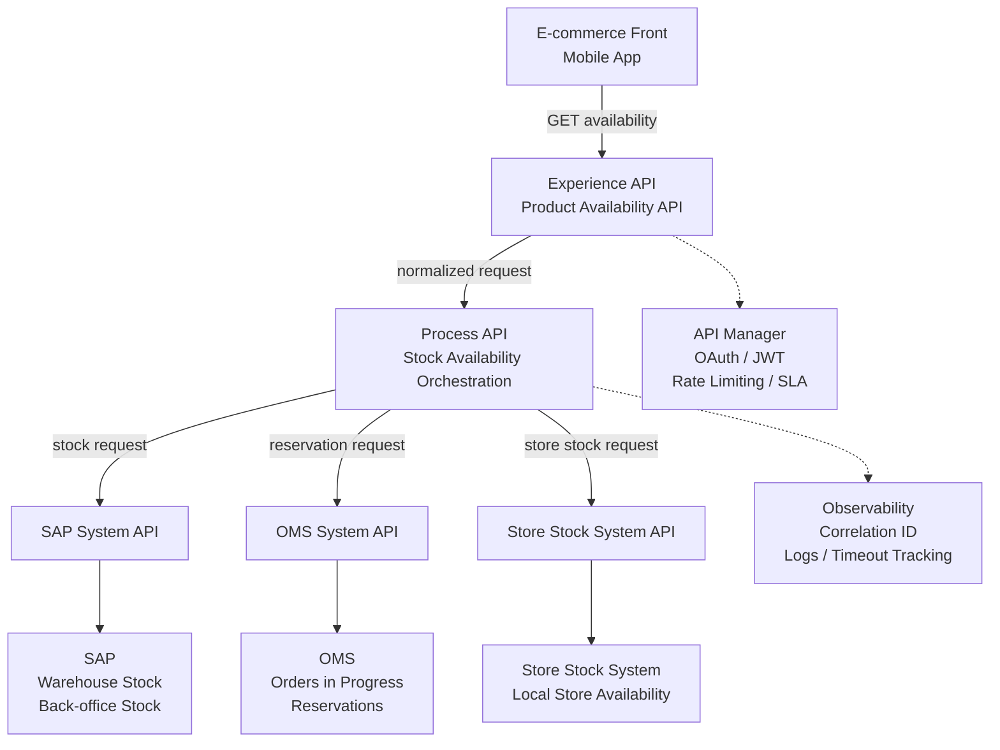

# stock-availability-api-mulesoft-case-study
End-to-end MuleSoft API-led integration case study for a retail stock availability API.
# Stock Availability API — MuleSoft Integration Case Study

## Overview

This project simulates the end-to-end delivery of a Stock Availability API in a retail/e-commerce context.

The goal is to demonstrate how an integration profile contributes from business requirement clarification to API design, interface contract, MuleSoft implementation, API governance, deployment and testing.

This is a simulated case study with mocked source systems. The focus is on integration architecture, API contract design, governance, testing and troubleshooting.

## Business Context

A retail company wants to expose product stock availability to its e-commerce front and checkout service.

The availability logic depends on multiple systems:

- SAP: back-office / warehouse stock
- OMS: orders in progress and reservations
- Store Stock System: local store stock
- E-commerce front: API consumer

The API must answer questions such as:

- Is the product available?
- What quantity is available?
- Can the product be added to the cart?
- Can the cart proceed to checkout?
- What should happen if the product is out of stock?

## My Role

As an Integration PM / API Delivery profile evolving toward Integration Architecture, my responsibilities in this case study are:

1. Clarify the business need and API consumers
2. Identify source systems and data ownership
3. Define an API-led architecture
4. Design the interface contract in RAML
5. Review SLA, security, and error handling requirements
6. Align the contract with developers and consumers
7. Publish the API specification to Exchange
8. Design MuleSoft flows in Anypoint Studio
9. Define DataWeave transformation examples
10. Prepare CloudHub deployment configuration
11. Configure API Manager policies
12. Monitor deployment through Runtime Manager
13. Execute Postman test scenarios
14. Document troubleshooting scenarios

## Target Architecture

**API Example**
GET /products/P001/availability?storeId=PARIS001&channel=web

**Example response when product is available:**

{
  "productId": "P001",
  "storeId": "PARIS001",
  "channel": "web",
  "available": true,
  "availableQuantity": 7,
  "canAddToCart": true,
  "canCheckout": true,
  "availabilityStatus": "AVAILABLE",
  "fulfillmentMode": "CLICK_AND_COLLECT",
  "lastUpdatedAt": "2026-05-12T10:30:00Z"
}

